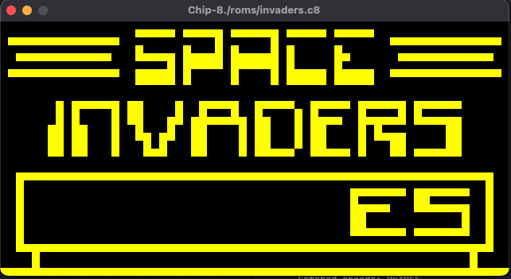

# 👾 Chip-8 Emulator 👾

CHIP-8 emulator written in pure Go. 🕹️



## Summary 📖

I did this little project out of curiosity, to find out how an emulator worked, 
how the first video games worked and how the programmers of that time dealt with 
solving and making problems with hardware with very little power.

I invite you to improve the project, if you find something that can be improved, 
you can make a pull request. 🫡

*I will improve the emulator gradually.*

## TODO 📝
I'll be working in some issues to improve the emulator

- [ ] Use of channels to capture the Quit or interrupt the emulation execution.
- [ ] Sound speaker / beeper with SDL Library
- [ ] Delay timer to process the instruction to 60Hz
- [ ] Improve the code, more modular.
- [ ] Resolves incompatibility issues, now only works with some games, not all.
- [ ] Catch system signals

## Built with 🧰

- [Golang](https://go.dev/)
- [SDL](https://www.libsdl.org/) and [SDL Golang Library](https://github.com/veandco/go-sdl2)

### Docs 🔍

[Chip-8 Documentation](http://devernay.free.fr/hacks/chip8/C8TECH10.HTM)

## Usage 📐

I need to improve this but, at the moment the only thing you need
to do is to get the Space Invaders ROM with file extension ".c8"
and put in a directory, and in the main.go file set the file path.

Then, the only thing you need to do is RUN the program with `go run cmd/chip8/main.go` 
or if you want to compiled version, with `go build cmd/chip8/main.go` and
enjoy 🥰.

## Memory Map diagram

```
+---------------+= 0xFFF (4095) End of Chip-8 RAM
|               |
|               |
|               |
|               |
|               |
| 0x200 to 0xFFF|
|     Chip-8    |
| Program / Data|
|     Space     |
|               |
|               |
|               |
+- - - - - - - -+= 0x600 (1536) Start of ETI 660 Chip-8 programs
|               |
|               |
|               |
+---------------+= 0x200 (512) Start of most Chip-8 programs
| 0x000 to 0x1FF|
| Reserved for  |
|  interpreter  |
+---------------+= 0x000 (0) Start of Chip-8 RAM

```

The original CHIP-8 used a hexadecimal keyboard so, for 
these times I changed the keys to normal keyboards:

```
Keypad       Keyboard
+-+-+-+-+    +-+-+-+-+
|1|2|3|C|    |1|2|3|4|
+-+-+-+-+    +-+-+-+-+
|4|5|6|D|    |Q|W|E|R|
+-+-+-+-+ => +-+-+-+-+
|7|8|9|E|    |A|S|D|F|
+-+-+-+-+    +-+-+-+-+
|A|0|B|F|    |Z|X|C|V|
+-+-+-+-+    +-+-+-+-+
```

Made with ❤️ by [Miguel Toledano](https://www.instagram.com/migantoju/)

My website [Codingtaco](https://codingtaco.com)